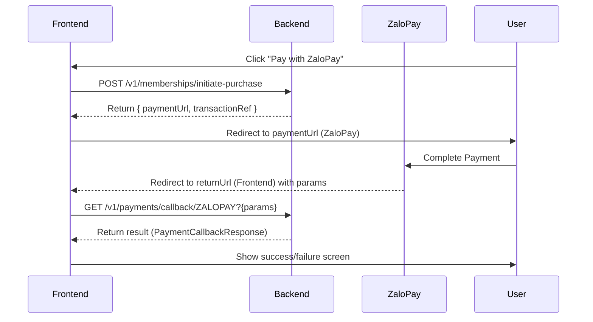

# ZaloPay Integration Guide

This document explains how to integrate **ZaloPay** payment in the frontend application.

## Payment Flow Overview

The ZaloPay integration follows the standard redirect-based payment flow:



---

## Step 1: Create Payment

Call the initiate purchase endpoint with `paymentProvider: "ZALOPAY"`.

### Endpoint
`POST /v1/memberships/initiate-purchase`

### Request Body
```json
{
  "membershipId": 1,
  "paymentProvider": "ZALOPAY"
}
```

### Response Example
```json
{
  "code": "200000",
  "message": "success",
  "data": {
    "transactionRef": "23484944-37b6-4327-a60e-f2d16f0851c0",
    "paymentUrl": "https://qc-openapi.zalopay.vn/v2/checkout?order_token=...",
    "provider": "ZALOPAY",
    "amount": 700000,
    "currency": "VND",
    "createdAt": "2026-04-05T16:00:19Z",
    "expiresAt": "2026-04-05T16:15:19Z"
  }
}
```

---

## Step 2: Redirect to ZaloPay

Use the `paymentUrl` from the response to redirect the user to ZaloPay's checkout page.

```javascript
window.location.href = result.data.paymentUrl;
```

---

## Step 3: Handle Payment Result (Callback)

After the user completes the payment, ZaloPay will redirect the user back to your frontend `returnUrl` (e.g., `https://www.smartrent.io.vn/payment/result`).

ZaloPay will append several query parameters to this URL:
- `appid`
- `apptransid`
- `zp_trans_id`
- `status`
- `checksum`
- etc.

### Implementation in Frontend

You should capture **all query parameters** and send them to the backend callback endpoint.

#### Endpoint
`GET /v1/payments/callback/ZALOPAY`

#### Example (Next.js/React)
```typescript
// pages/payment/result.tsx
import { useEffect } from 'react';
import { useSearchParams } from 'next/navigation';

export default function ZaloPayResult() {
  const searchParams = useSearchParams();

  useEffect(() => {
    const processCallback = async () => {
      // Capture all params
      const queryString = searchParams.toString();
      
      try {
        const response = await fetch(`/v1/payments/callback/ZALOPAY?${queryString}`);
        const result = await response.json();
        
        if (result.data.success) {
          // Show success message
        } else {
          // Show error message (e.g., User cancelled)
        }
      } catch (error) {
        console.error("Callback error", error);
      }
    };

    if (searchParams.has('apptransid')) {
      processCallback();
    }
  }, [searchParams]);

  return <div>Processing ZaloPay result...</div>;
}
```

---

## Important Notes

### 1. Transaction Mapping
ZaloPay uses an `apptransid` (formatted as `yyMMdd_transactionId`). 
- On the backend, we map this back to our internal `transaction_id`.
- The frontend doesn't need to worry about this mapping; just pass the `apptransid` as part of the query string to the callback API.

### 2. Status Codes
Common ZaloPay redirect statuses:
- `1`: Success
- `-1`: Failed
- `2`: User cancelled (or other errors)

The backend handles these status codes and returns a unified `PaymentCallbackResponse`.

---

## API Reference: Callback Response

```json
{
  "code": "200000",
  "message": "Payment completed successfully",
  "data": {
    "transactionRef": "23484944-37b6-4327-a60e-f2d16f0851c0",
    "providerTransactionId": "240405_zp_12345",
    "status": "COMPLETED",
    "success": true,
    "signatureValid": true,
    "message": "Payment successful"
  }
}
```
