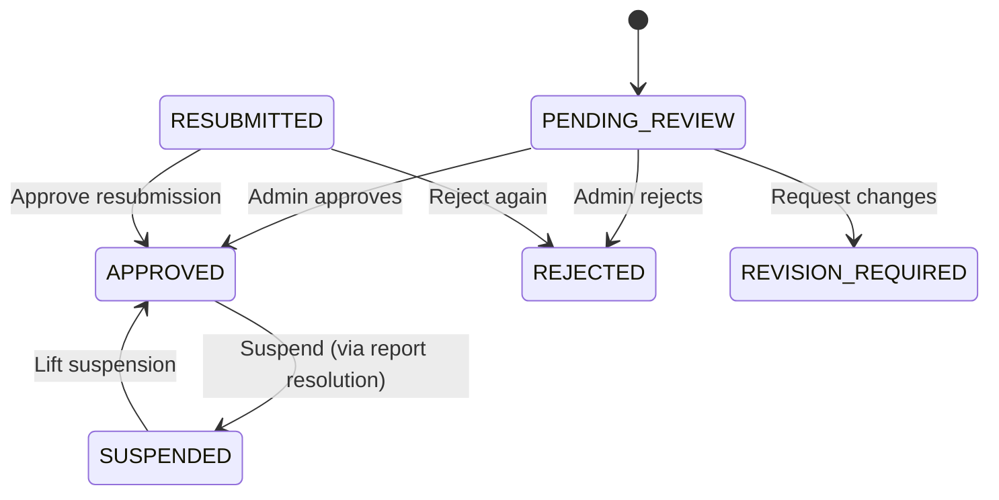

# Listing Moderation — Admin FE Integration Guide

> This document covers API changes and UI patterns for **administrators** managing the listing moderation workflow.

---

## 1. Moderation Lifecycle (Admin Perspective)



**Admin Actions:**
| Action | When | Effect |
|--------|------|--------|
| `APPROVE` | Listing in `PENDING_REVIEW` / `RESUBMITTED` | Sets listing live |
| `REJECT` | Listing in `PENDING_REVIEW` / `RESUBMITTED` | Auto-hides listing |
| `REQUEST_REVISION` | Listing in `PENDING_REVIEW` / `RESUBMITTED` | Keeps listing visible, notifies owner |
| `SUSPEND` | Any state (via report resolution) | Hides listing immediately |

---

## 2. API Endpoints

### 2.1 Moderate a Listing (new format)

```
PUT /v1/admin/listings/verify/{listingId}
Authorization: Bearer <admin-token>
Content-Type: application/json
```

**New request format (preferred):**
```json
{
  "decision": "REJECT",
  "reasonCode": "MISLEADING_CONTENT",
  "reasonText": "Listing title and description do not match the property photos",
  "internalNotes": "Reported by 3 users, confirmed misleading"
}
```

**Fields:**
| Field | Type | Required | Description |
|-------|------|----------|-------------|
| `decision` | `APPROVE` / `REJECT` / `REQUEST_REVISION` / `SUSPEND` | yes | Moderation decision |
| `reasonCode` | string | no (required for non-APPROVE) | Structured reason code |
| `reasonText` | string | no | Human-readable reason (shown to owner) |
| `internalNotes` | string | no | Admin-only notes (not seen by owner) |

**Legacy format still supported:**
```json
{
  "verified": true,
  "reason": "Optional rejection reason"
}
```

### 2.2 Resolve Report with Owner Action

```
PUT /v1/admin/reports/{reportId}/resolve
Authorization: Bearer <admin-token>
Content-Type: application/json
```

**Extended request:**
```json
{
  "status": "RESOLVED",
  "adminNotes": "Report is valid, listing contains misleading info",
  "ownerActionRequired": true,
  "ownerActionType": "UPDATE_LISTING",
  "ownerActionDeadlineDays": 7
}
```

**New fields:**
| Field | Type | Default | Description |
|-------|------|---------|-------------|
| `ownerActionRequired` | boolean | `false` | Whether to trigger owner action flow |
| `ownerActionType` | `UPDATE_LISTING` / `PROVIDE_PROOF` / `REMOVE_CONTENT` | `UPDATE_LISTING` | Type of owner action |
| `ownerActionDeadlineDays` | integer | `null` | Days until deadline (null = no deadline) |

### 2.3 Admin Listing List (with moderation context)

```
POST /v1/admin/listings
Authorization: Bearer <admin-token>
```

**New fields in each listing:**
```jsonc
{
  "listingId": 123,
  "moderationStatus": "PENDING_REVIEW",   // NEW
  "revisionCount": 0,                     // NEW
  "lastModerationReasonCode": null,       // NEW
  "lastModerationReasonText": null,       // NEW
  "adminVerification": { /* existing */ }
}
```

---

## 3. UI Implementation Guide

### 3.1 Moderation Queue

**Filter by moderation status:**
```typescript
// Suggested queue tabs
const ADMIN_QUEUE_TABS = [
  { key: 'pending',    label: 'Chờ duyệt',     filter: { moderationStatus: 'PENDING_REVIEW' } },
  { key: 'resubmitted',label: 'Gửi lại',       filter: { moderationStatus: 'RESUBMITTED' } },
  { key: 'rejected',   label: 'Đã từ chối',    filter: { moderationStatus: 'REJECTED' } },
  { key: 'suspended',  label: 'Tạm ngưng',     filter: { moderationStatus: 'SUSPENDED' } },
  { key: 'all',        label: 'Tất cả',        filter: {} },
];
```

> **Note:** Filtering by `moderationStatus` is not yet implemented server-side. Until then, use the existing `verified` / `isVerify` filters and use `moderationStatus` client-side for display.

### 3.2 Review Decision Form

```
┌─────────────────────────────────────────────────────┐
│  Decision:  [Approve] [Reject] [Request Revision]   │
│                                                     │
│  Reason Code:  [ MISLEADING_CONTENT ▼ ]             │
│  Reason (shown to owner):                           │
│  ┌─────────────────────────────────────────────┐    │
│  │ Photos don't match the actual property...   │    │
│  └─────────────────────────────────────────────┘    │
│  Internal Notes (admin only):                       │
│  ┌─────────────────────────────────────────────┐    │
│  │ 3 user reports confirmed, photos are from...│    │
│  └─────────────────────────────────────────────┘    │
│                                     [ Submit ]      │
└─────────────────────────────────────────────────────┘
```

**Suggested reason codes (client-side dropdown):**
```typescript
const REASON_CODES = [
  { value: 'INCOMPLETE_INFO',      label: 'Thông tin không đầy đủ' },
  { value: 'MISLEADING_CONTENT',   label: 'Nội dung gây hiểu lầm' },
  { value: 'DUPLICATE_LISTING',    label: 'Bài đăng trùng lặp' },
  { value: 'POLICY_VIOLATION',     label: 'Vi phạm chính sách' },
  { value: 'INAPPROPRIATE_MEDIA',  label: 'Hình ảnh không phù hợp' },
  { value: 'MISSING_INFO',         label: 'Thiếu thông tin bắt buộc' },
  { value: 'OTHER',                label: 'Lý do khác' },
];
```

### 3.3 Report Resolution with Owner Action

When resolving a report, show "Require Owner Action" toggle:

```typescript
// Conditional fields shown when ownerActionRequired=true
{
  ownerActionRequired && (
    <>
      <Select label="Loại hành động" name="ownerActionType"
              options={[
                { value: 'UPDATE_LISTING',  label: 'Chỉnh sửa bài đăng' },
                { value: 'PROVIDE_PROOF',   label: 'Cung cấp chứng từ' },
                { value: 'REMOVE_CONTENT',  label: 'Gỡ nội dung vi phạm' },
              ]} />
      <NumberInput label="Hạn xử lý (ngày)" name="ownerActionDeadlineDays"
                   placeholder="Để trống = không giới hạn" />
    </>
  )
}
```

### 3.4 Revision Count Indicator

Show `revisionCount` on listings that have been resubmitted:

```typescript
{listing.revisionCount > 0 && (
  <Badge variant="outline">
    Lần gửi lại: {listing.revisionCount}
  </Badge>
)}
```

---

## 4. Email Notifications

The system sends automatic email notifications to listing owners on these events:
- **Approved** → Congratulations email
- **Rejected** → Reason + instructions to edit & resubmit
- **Revision Required** → Specific changes requested + deadline
- **Suspended** → Reason + support contact info
- **Resubmitted** (to admin) → Notification of resubmission

No FE action needed — these are handled server-side.

---

## 5. Backward Compatibility

| Feature | Old Format | New Format | Both Work? |
|---------|-----------|-----------|:----------:|
| Approve/Reject | `{ "verified": true/false }` | `{ "decision": "APPROVE" }` | ✅ |
| Report resolve | `{ "status": "RESOLVED" }` | `{ "status": "RESOLVED", "ownerActionRequired": true }` | ✅ |
| Listing response | `verified`, `isVerify` | `moderationStatus` | ✅ |

The new `moderationStatus` field is **additive** — no existing API contracts change.
