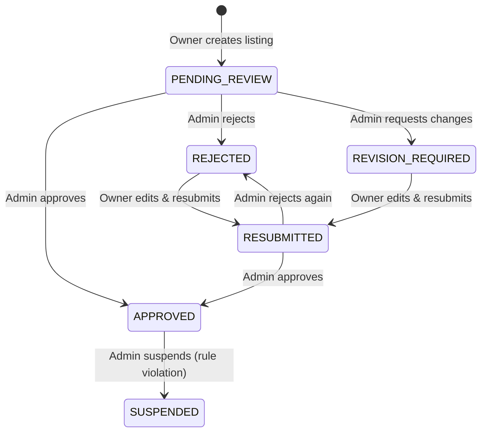

# Listing Moderation — Owner / User FE Integration Guide

> This document covers API changes and UI patterns for listing **owners** interacting with the moderation lifecycle.

---

## 1. Moderation Lifecycle (Owner Perspective)



**Key states owners care about:**
| State | Meaning | Owner Action |
|-------|---------|-------------|
| `PENDING_REVIEW` | Listing awaiting admin review | Wait |
| `APPROVED` | Listing is live / verified | None |
| `REJECTED` | Admin rejected the listing | Edit & resubmit |
| `REVISION_REQUIRED` | Admin requests specific changes | Edit & resubmit |
| `RESUBMITTED` | Owner resubmitted, awaiting re-review | Wait |
| `SUSPENDED` | Listing suspended for rule violation | Contact support |

---

## 2. API Endpoints

### 2.1 Get My Listing Detail (with moderation info)

```
GET /v1/listings/{id}/my-detail
Authorization: Bearer <token>
```

**New fields in response:**

```jsonc
{
  "listingId": 123,
  "title": "...",
  "listingStatus": "REJECTED",        // computed status (existing)
  
  // ── NEW: Moderation Context ──
  "moderationStatus": "REJECTED",      // canonical moderation state
  "verificationNotes": "Missing legal documentation for property ownership",
  "rejectionReason": "MISSING_INFO",   // structured reason code
  
  "pendingOwnerAction": {              // null if no action pending
    "actionId": 45,
    "ownerActionType": "UPDATE_LISTING",
    "ownerActionStatus": "PENDING_OWNER",
    "triggerType": "LISTING_REJECTED",
    "deadlineAt": "2025-02-20T23:59:59",  // nullable
    "notes": "Please add property ownership proof",
    "createdAt": "2025-02-11T10:00:00"
  },
  
  "moderationTimeline": [              // most recent first
    {
      "eventId": 12,
      "action": "REJECT",
      "moderationSource": "NEW_SUBMISSION",
      "actorType": "ADMIN",
      "actorId": "admin-001",
      "reasonCode": "MISSING_INFO",
      "reasonText": "Missing legal documentation for property ownership",
      "notes": null,
      "createdAt": "2025-02-11T10:00:00"
    }
  ]
}
```

### 2.2 Get My Listings (list view)

```
POST /v1/listings/my-listings
Authorization: Bearer <token>
```

Response includes `moderationStatus` and `pendingOwnerAction` per listing (timeline is omitted for performance in list view).

### 2.3 Resubmit Listing for Review

```
POST /v1/listings/{id}/resubmit-for-review
Authorization: Bearer <token>
Content-Type: application/json

{
  "notes": "Updated listing with property ownership documents"  // optional
}
```

**Preconditions:**
- Listing `moderationStatus` must be `REJECTED` or `REVISION_REQUIRED`
- Caller must be the listing owner

**Success Response:**
```json
{
  "code": "999999",
  "message": "Listing resubmitted for review successfully",
  "data": null
}
```

**Error Responses:**
| Code | Meaning |
|------|---------|
| `RESUBMIT_NOT_ALLOWED` | Listing is not in a resubmittable state |
| `NOT_LISTING_OWNER` | Authenticated user does not own this listing |
| `LISTING_NOT_FOUND` | Listing ID does not exist |

---

## 3. UI Implementation Guide

### 3.1 Status Badge Component

Map `moderationStatus` to visual badges:

```typescript
const MODERATION_BADGES = {
  PENDING_REVIEW:    { label: 'Đang chờ duyệt',     color: 'yellow', icon: 'clock' },
  APPROVED:          { label: 'Đã duyệt',           color: 'green',  icon: 'check' },
  REJECTED:          { label: 'Bị từ chối',          color: 'red',    icon: 'x-circle' },
  REVISION_REQUIRED: { label: 'Cần chỉnh sửa',      color: 'orange', icon: 'edit' },
  RESUBMITTED:       { label: 'Đã gửi lại',         color: 'blue',   icon: 'refresh' },
  SUSPENDED:         { label: 'Bị tạm ngưng',       color: 'gray',   icon: 'ban' },
};
```

### 3.2 Banner / CTA Logic

```typescript
function getModerationBanner(listing) {
  const { moderationStatus, pendingOwnerAction } = listing;

  if (moderationStatus === 'REJECTED' || moderationStatus === 'REVISION_REQUIRED') {
    return {
      type: 'warning',
      title: moderationStatus === 'REJECTED' ? 'Bài đăng bị từ chối' : 'Yêu cầu chỉnh sửa',
      message: listing.verificationNotes,
      cta: { label: 'Chỉnh sửa và gửi lại', action: 'EDIT_AND_RESUBMIT' },
      deadline: pendingOwnerAction?.deadlineAt,
    };
  }

  if (moderationStatus === 'RESUBMITTED') {
    return {
      type: 'info',
      title: 'Đang chờ duyệt lại',
      message: 'Bài đăng đã được gửi lại và đang chờ quản trị viên xem xét.',
    };
  }

  if (moderationStatus === 'SUSPENDED') {
    return {
      type: 'error',
      title: 'Bài đăng bị tạm ngưng',
      message: listing.verificationNotes,
      cta: { label: 'Liên hệ hỗ trợ', action: 'CONTACT_SUPPORT' },
    };
  }

  return null; // No banner needed for PENDING_REVIEW or APPROVED
}
```

### 3.3 Resubmit Flow

1. Owner clicks **"Chỉnh sửa"** → navigate to edit form for listing
2. Owner makes edits → call `PUT /v1/listings/{id}` to save changes
3. Show confirmation dialog with optional notes field
4. Call `POST /v1/listings/{id}/resubmit-for-review` with notes
5. On success → redirect to listing detail, show `RESUBMITTED` status

### 3.4 Moderation Timeline Component

Display `moderationTimeline` as a vertical timeline showing the history of moderation events:

```
┌──────────────────────────────────────────┐
│  🔴 Rejected  •  Feb 11, 2025 10:00 AM  │
│  Reason: Missing legal documentation     │
│                                          │
│  🟡 Submitted for Review  •  Feb 10      │
│  Source: New submission                  │
└──────────────────────────────────────────┘
```

### 3.5 Deadline Handling

When `pendingOwnerAction.deadlineAt` is set:
- Show countdown/relative time (e.g., "3 ngày còn lại")
- Show urgent styling when < 24h remaining
- If expired, show "Đã hết hạn" with disabled CTA

---

## 4. Backward Compatibility

- `listingStatus` (computed) continues to work as before (`IN_REVIEW`, `REJECTED`, `DISPLAYING`, etc.)
- `moderationStatus` is a **new field** — use it for granular moderation UI
- `verified` / `isVerify` booleans remain unchanged
- Existing listing creation and update flows are unaffected
